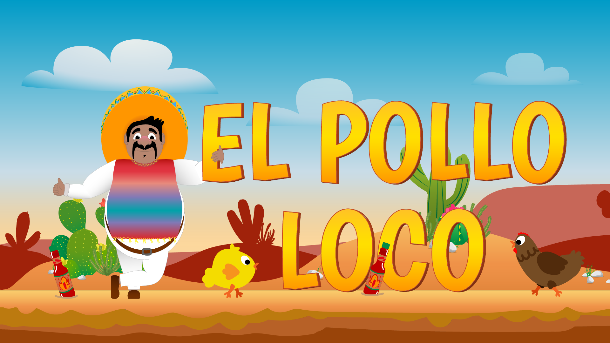

# El Pollo Loco

El Pollo Loco is a browser-based 2D jump-and-run game built with vanilla JavaScript and the HTML5 Canvas API. Guide Pepe through the desert, collect coins and salsa bottles, defeat chickens, and face the final boss.



## Features

- Character movement, jumping, idle, sleeping, hurt, and death animations
- Normal and small chicken enemies
- Animated end boss with multiple combat states
- Collectible coins and salsa bottles
- Throwable bottles with rotation, splash, and collision effects
- Health, coin, bottle, and boss status bars
- Background music and sound effects with a persistent mute setting
- Win and game-over screens with restart support
- Keyboard and touch controls
- Responsive landscape layout for desktop, tablet, and smartphone
- Pause menu and controls dialog

## Controls

| Action | Keyboard | Touch |
| --- | --- | --- |
| Move left | Left arrow or `A` | Left arrow button |
| Move right | Right arrow or `D` | Right arrow button |
| Jump | Space | Jump button |
| Throw bottle | `R` | Bottle button |

## How to play

Collect salsa bottles and use them against the chickens. You can also defeat regular chickens by jumping on them from above. Save enough bottles for the end boss and avoid enemy attacks to keep Pepe's health from reaching zero.

## Run locally

No build process or package installation is required.

1. Clone the repository:

   ```bash
   git clone https://github.com/ChristianMulugeta/El_Pollo_Loco.git
   ```

2. Open the project folder.
3. Start a local web server, for example with the VS Code Live Server extension.
4. Open `index.html` through the local server in your browser.

## Built with

- HTML5
- CSS3
- Vanilla JavaScript
- Canvas API
- Object-oriented programming

## Project structure

```text
El_Pollo_Loco/
├── audio/       # Music and sound effects
├── classes/     # Game objects and game logic
├── img/         # Sprites, backgrounds, and interface images
├── levels/      # Level configuration
├── index.html   # Main game page
├── script.js    # Game setup and interface controls
├── style.css    # Main styling
└── style-responsive.css
```

## About

This project was created as part of a web development course to practise object-oriented JavaScript, canvas rendering, animation, collision detection, audio handling, and responsive controls.
